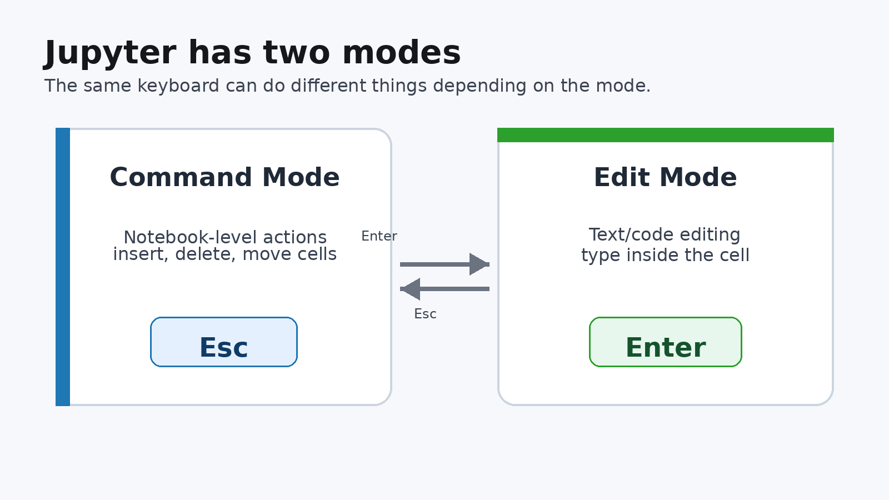
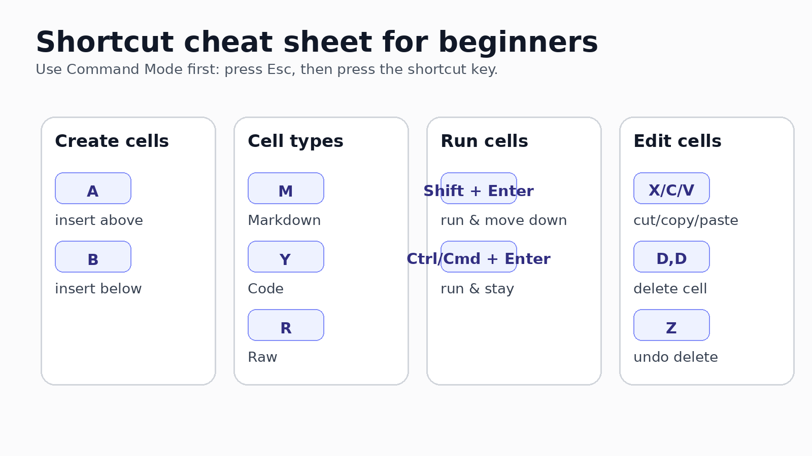
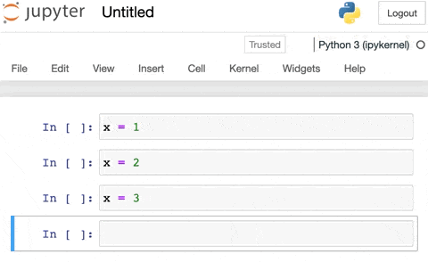
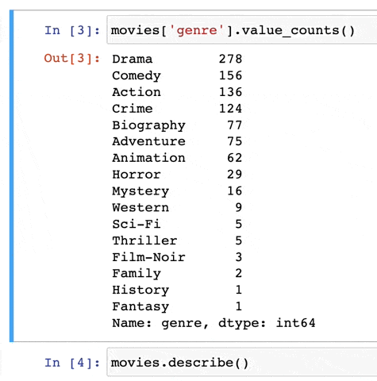
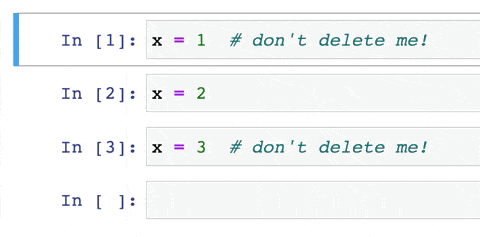
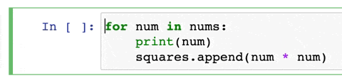
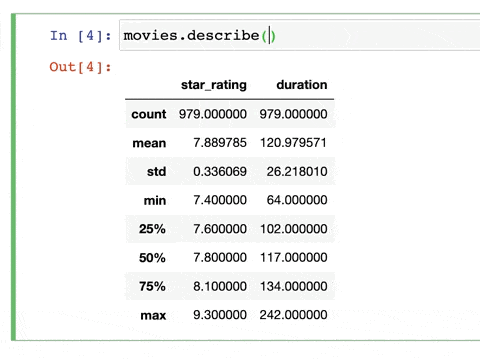
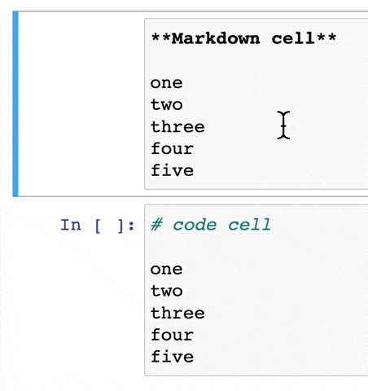

## Learning goals

By the end of this short tutorial, students should be able to:

- explain the difference between **Command Mode** and **Edit Mode**
- change a cell to **Markdown**, **Code**, or **Raw**
- run cells using keyboard shortcuts
- use a small set of shortcuts to work faster in Jupyter

::: {.callout-note}
The goal is not to memorize every shortcut. Start with the few that save the most time.
:::

## Why keyboard shortcuts matter

Jupyter notebooks are built from **cells**.

Each cell can hold:

- Python code
- Markdown text
- raw text for special export workflows

Shortcuts help you move quickly between these tasks without constantly using the mouse.

## The key idea: two modes

{fig-alt="Diagram comparing command mode and edit mode in Jupyter"}

## Command Mode vs. Edit Mode

In **Command Mode**, Jupyter listens for notebook-level commands.

In **Edit Mode**, Jupyter lets you type inside a cell.

{fig-alt="Animated example of command and edit mode in Jupyter" width="78%"}

## Switching modes

| Goal | Shortcut |
|---|---|
| Switch to Command Mode | `Esc` |
| Switch to Edit Mode | `Enter` |

**Classroom tip:** When a shortcut does not work, first press `Esc` and try again.

## The beginner shortcut map

{fig-alt="Cheat sheet of beginner Jupyter keyboard shortcuts"}

## Change cell type

Use these shortcuts in **Command Mode**.

| Cell type | Shortcut | Use it for |
|---|---:|---|
| Markdown | `M` | explanations, headings, instructions |
| Code | `Y` | Python code |
| Raw | `R` | unformatted text, nbconvert workflows |

## Run cells

| Action | Shortcut |
|---|---|
| Run cell and move down | `Shift + Enter` |
| Run cell and stay | `Ctrl + Enter` or `Cmd + Enter` |

For teaching, `Shift + Enter` is the most useful habit.

## Insert and delete cells

Use these in **Command Mode**.

| Action | Shortcut |
|---|---|
| Insert cell above | `A` |
| Insert cell below | `B` |
| Delete selected cell | `D`, then `D` again |
| Undo cell deletion | `Z` |

## Live demo 1: cell types

Ask students to do this in a notebook:

1. Click a cell.
2. Press `Esc`.
3. Press `M` to make it Markdown.
4. Type a heading such as `## My first notebook note`.
5. Press `Shift + Enter`.
6. Press `Y` to make the next cell a Code cell.

## Live demo 2: run Python code

```{python}
# A small example for practicing Shift + Enter
course = "BANL 3100"
topic = "Jupyter shortcuts"

print(course)
print(topic)
```

## Live demo 3: small data example

```{python}
import pandas as pd

scores = pd.DataFrame({
    "hours_studied": [1, 2, 3, 4, 5, 6],
    "quiz_score": [62, 68, 73, 78, 85, 91]
})

scores
```

## Live demo 4: plotnine example

```{python}
from plotnine import ggplot, aes, geom_point, geom_smooth, labs, theme_minimal

(
    ggplot(scores, aes(x="hours_studied", y="quiz_score"))
    + geom_point(size=3)
    + geom_smooth(method="lm", se=False)
    + labs(
        title="Study time and quiz score",
        x="Hours studied",
        y="Quiz score"
    )
    + theme_minimal()
)
```

## Command palette

The command palette is useful when you forget a shortcut.

- Classic Notebook: `P` in Command Mode
- JupyterLab: `Cmd + Shift + C` on Mac or `Ctrl + Shift + C` on Windows/Linux

{fig-alt="Animated example of the Jupyter command palette" width="78%"}

## Toggle output

Sometimes a cell output becomes too large.

In classic Jupyter Notebook:

- press `Esc`
- select the cell
- press `O`

{fig-alt="Animated example of toggling cell output in Jupyter" width="78%"}

## Undo cell deletion

Deleted the wrong cell?

Press `Z` in **Command Mode**.

{fig-alt="Animated example of undoing a deleted Jupyter cell" width="78%"}

## Comment and uncomment code

Use this in **Edit Mode**.

| System | Shortcut |
|---|---|
| Mac | `Cmd + /` |
| Windows/Linux | `Ctrl + /` |

{fig-alt="Animated example of commenting and uncommenting code" width="78%"}

## Function help with docstrings

When your cursor is inside a function call, press:

`Shift + Tab`

This opens help for the function.

{fig-alt="Animated example of using Shift Tab to show a docstring" width="78%"}

## Multiple cursors

Multiple cursors are useful when editing similar lines.

- Mac: hold `Option`, then drag
- Windows/Linux: hold `Alt`, then drag

{fig-alt="Animated example of multiple cursors in Jupyter" width="78%"}

## Practice drill: 5 minutes

Open the companion notebook and complete this sequence:

1. Create a Markdown cell above the first code cell.
2. Add a heading and one sentence.
3. Create a Code cell below it.
4. Run the code using `Shift + Enter`.
5. Delete one practice cell.
6. Undo the deletion with `Z`.

## JupyterLab and VS Code notes

Most core shortcuts are the same:

- `M` for Markdown
- `Y` for Code
- `A` and `B` for new cells
- `Shift + Enter` to run and move down

Some shortcuts may differ, especially `R` for Raw cells and command-palette shortcuts.

## What to memorize first

Start with only these:

| Shortcut | Meaning |
|---|---|
| `Esc` | Command Mode |
| `Enter` | Edit Mode |
| `M` / `Y` / `R` | Markdown / Code / Raw |
| `Shift + Enter` | Run and move down |
| `A` / `B` | Insert above / below |
| `D,D` / `Z` | Delete / undo deletion |

## Closing idea

A notebook is not just code.

It is a communication document:

- Markdown explains the work.
- Code performs the work.
- Output shows the evidence.

Good shortcuts help students focus on the story instead of the interface.

